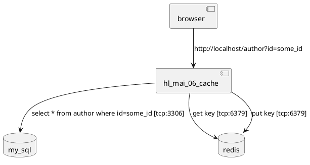

## Пример по курсу Архитектура Программных систем

Тестовый запрос для добавления в MySQL и кэш:

http://localhost/author?add&first_name=*Vasia*&last_name=Pupkin&title=Mr&email=vasia@pupkin.com

Тестовый запрос для поиска в кэше:

http://*localhost*/author?id=*some_id -* поиск записей (шаблон сквозное-чтение)

http://*localhost*/author?id=*some_id&no_cache -* поиск записей буз кеша

### Бибилиотека для работы с redis
https://github.com/tdv/redis-cpp